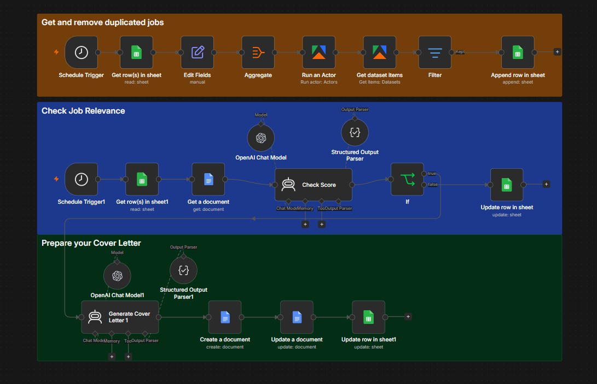
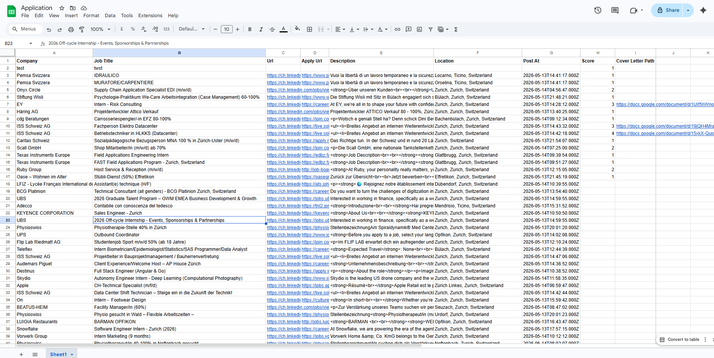

# AI Linkedin Job Matcher Agent using n8n workflow

AI-powered workflow built with n8n that automates the job application pipeline.

## Features

* Collects job postings automatically
* Removes duplicates
* Matches job descriptions against a resume using AI
* Scores job relevance from 1–5 where:
1 = Very poor match
2 = Weak match
3 = Moderate match
4 = Strong match
5 = Excellent match
* Generates personalized cover letters automatically
* Saves generated documents to Google Docs in Drive.

---

## Why I Built This

I built this workflow to automate and optimize my own job application process.

Instead of manually reviewing hundreds of job postings, the workflow uses AI to identify relevant opportunities and generate tailored cover letters automatically.

---

## Stack

* n8n
* OpenAI
* Google Sheets
* Google Docs
* Apify

---

## Workflow Overview

### Workflow

### Dataset Example

---

## How It Works

1. Scrape and collect job postings
2. Store postings in Google Sheets
3. Compare each posting against a resume
4. Generate AI relevance scores
5. Create tailored cover letters for matching jobs with score >= 3

---

## Import into n8n

1. Download the workflow JSON
2. Open n8n
3. Import from file
4. Configure credentials:

   * OpenAI
   * Google Sheets
   * Google Docs
   * Apify

---

## Files

* `workflow/linkedin-agent.json` → n8n workflow
* `assets/` → screenshots
* `.env.example` → required environment variables

---

## Notes

Before using:

* configure credentials
* replace placeholder IDs
* set your own prompts and resume template

---

## License

MIT
